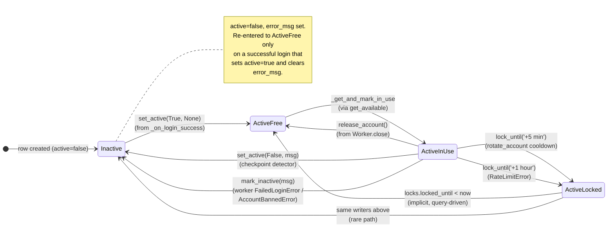
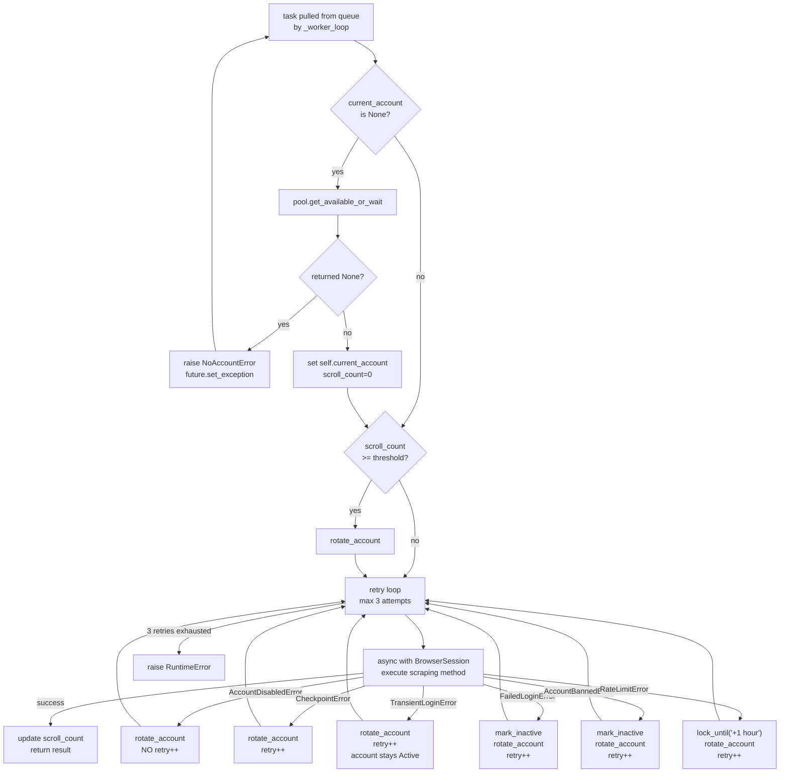

# Account Management

Accounts live in `db/accounts.db` (schema in `fbscrape/db.py:63-168`). The pool
(`fbscrape/accounts_pool.py:AccountsPool`) is the single source of truth for
account state — workers borrow accounts via `pool.get_available_or_wait()` and
return them via `release_account()` or `rotate_account()`. Login outcomes
(success / checkpoint / banned / transient flake) drive the state machine
defined below; the worker's `except` clauses (`fbscrape/worker.py:282-347`)
translate exceptions into the corresponding pool calls.

## Account States

Every account is in exactly one of four logical states. Transitions are labeled
with the method that performs the change.



**Notes**:
- `error_msg` is **set** when an account becomes Inactive and **cleared** when
  `_on_login_success` calls `set_active(True, None)` (`browser_session.py:435`).
- `ActiveLocked → ActiveFree` is not effected by an explicit method call. The
  `get_available()` SQL filters out rows whose `locked_until` is still in the
  future; once it has passed, the row is selectable again.
- `Inactive` accounts are never `in_use` (the `mark_inactive` UPDATE also sets
  `in_use=false`, see `accounts_pool.py:406-414`).

## Task Execution Flow

What happens when a worker pulls a task off the queue:



**Notes**:
- The `current_account is None` guard at the top of `execute_task` exists
  because a previous task's `rotate_account()` may have raised `NoAccountError`
  (pool empty) and left `current_account = None`. The guard re-acquires (with
  wait, since locked accounts may free up) before falling through to
  `BrowserSession`.
- `rotate_account()` itself: `lock_until('+5 min')` on the current account →
  `release_account()` → set `current_account=None` → `initialize()` to acquire
  a new one (raises `NoAccountError` if pool empty).
- Detector→worker contract: `AccountDisabledError` and `CheckpointError` are
  raised by `_wait_for_log_in_outcome` *after* it has already written the
  account's `error_msg` and flipped `active=false`. The worker's clauses for
  those two **do not** call `mark_inactive` again — they would clobber the
  specific message. `TransientLoginError` and `FailedLoginError` are
  detector-doesn't-write contracts, so the worker's clause writes the DB.

## DB Field Reference

State-bearing columns of the `accounts` table (`db.py:63-168`). Credentials,
proxy, and fingerprint columns are omitted — they don't drive state.

| Column | Type | Meaning | Written by | Read by |
|---|---|---|---|---|
| `active` | BOOLEAN | Account is permitted for scraping. False ⇒ Inactive (banned, disabled, checkpointed). | `set_active()` (200), `mark_inactive()` (406) | `get_available()` SQL (306) |
| `in_use` | BOOLEAN | A worker currently holds the account. | `_get_and_mark_in_use()` (278), `release_account()` (382), `mark_inactive()` (406) | `get_available()` SQL |
| `locks` | JSON | Holds key `$.locked_until` (ISO 8601 datetime) when the account is rate-limited / cooling down. `NULL`/missing ⇒ not locked. | `lock_until()` (234), `unlock()` (256) | `get_available()` SQL, `next_available_at()` (360) |
| `error_msg` | TEXT | Human-readable reason an account became Inactive. Cleared on next successful login. | `set_active()` (200), `mark_inactive()` (406) | logs / admin queries |
| `last_used` | TEXT (ISO 8601) | Updated on every state-changing pool method touch. | `_get_and_mark_in_use`, `release_account`, `lock_until`, `unlock`, `update_scroll_count`, `update_last_used` | `_on_login_success` 24h-stale check (`browser_session.py:438`) |
| `scroll_count_overall_24h` | INTEGER | Total scrolls in last 24 h; reset by `_on_login_success` if `last_used` was > 24 h ago. | `update_scroll_count()` (457), `reset_scroll_counts()` (507) | worker scroll-threshold check (`worker.py:243`) |
| `scroll_count_per_endpoint_total` | JSON | Per-endpoint scroll totals. Same lifecycle as `_overall_24h`. | `update_scroll_count()` (457), `reset_scroll_counts()` (507) | scoping per-endpoint quotas |

All file/line references point to `fbscrape/accounts_pool.py` unless prefixed.

## Exception → State-Change Matrix

Every typed exception that affects account state, with the full chain from
detector → worker handler → final state.

| Exception | Raised by | DB written by | Worker handler | End state | retry++ |
|---|---|---|---|---|---|
| `AccountDisabledError` | `login.py:_wait_for_log_in_outcome` on `/checkpoint/disabled/` | detector via `set_active(False, "Account disabled by Facebook (…)")` | `worker.py` → `rotate_account()` only | **Inactive** | **No** (dead account doesn't burn retry budget) |
| `AutomationCheckpointError` | `login.py:_dispatch_login_outcome` on `/checkpoint/<id>/` + page body matches `_is_automation_suspected_checkpoint` ("suspect automated behavior") | none (worker writes) | `worker.py` → `rotate_account(lock_until='+24 hours', error_msg='automation suspected …')` | **Active**, locked +24h | Yes |
| `CheckpointError` | `login.py:_wait_for_log_in_outcome` on other `/checkpoint/` (after automation refinement) | detector via `set_active(False, "Checkpoint challenge — manual intervention required (…)")` | `worker.py` → `rotate_account()` | Inactive | Yes |
| `TransientLoginError` | `login.py login()` — internal retry exhausted, "URL never settled", "viewer never came through", **or a raw playwright `TimeoutError`/`TargetClosedError` from a bare `page.goto`/`reload` in the login flow (reclassified at the `login()` chokepoint — see note below)** | none (account stays Active) | `worker.py:302` → `rotate_account()` | **Active**, locked +5 min by rotate's cooldown | Yes |
| `FailedLoginError` (generic) | `browser_session.py:_resolve_not_logged_in` last-resort when `login()` returns False | none (worker writes) | `worker.py:313` → `mark_inactive()` + `rotate_account()` | Inactive | Yes |
| `AccountBannedError` | scraping methods (e.g., `user_timeline`) | none (worker writes) | `worker.py:326` → `mark_inactive()` + `rotate_account()` | Inactive | Yes |
| `RateLimitError` | scraping methods | none (worker writes) | `worker.py:337` → `lock_until('+1 hour')` + `rotate_account()` | **Active**, locked +1 hour | Yes |
| `NoAccountError` | `pool.get_available_or_wait()` returning None **or** `Worker.initialize()` failing | none | `worker.py:190` (worker_pool's `_worker_loop` catches via generic `except`) | n/a (no account held) | n/a |

> **`login()` transient-nav chokepoint.** The login helpers (`login_with_cookies`, `check_logged_in`) issue several *bare* `page.goto` / `page.reload` calls. A renderer/network flake there raises a raw playwright `TimeoutError` / `TargetClosedError` — which is **not** one of the typed-retry exceptions above, so it would escape untyped out of `execute_task`, get set on the future by `_worker_loop`, re-raise through `FacebookScraper.user_timeline`'s `await future`, and then through `gather()`'s `yield await c` — tearing down the **entire batch** (one bad navigation killing every other handle; observed in production 2026-06-02). `login()` wraps its orchestration in a narrow `except (TimeoutError, TargetClosedError)` that reclassifies *only* those two into `TransientLoginError`, so the worker rotates + retries instead. The catch is deliberately narrow: checkpoint/ban/disabled typed exceptions and the terminal `FailedLoginError` pass straight through, never swallowed.

> **Failed-task isolation (`worker_pool._worker_loop`).** Any exception that still reaches the worker loop (e.g. `RetryBudgetExhaustedError` after 3 rotations, or an unexpected error) is **resolved**, not raised: the generic `except` sets the future to a failed `ScrapingResult` (`result="task_failed: <ExcName>"`, `data=[]`) instead of `set_exception`. This stops one bad handle from propagating through `gather()` and killing the whole batch — the caller records the failure and the pool keeps serving. `NoAccountError` is exempt (keeps its requeue + worker-exit semantics). Partial data isn't preserved (no outcome on exception); failed handles are recoverable via `--continue`.

**Hierarchy** (`exceptions.py`):

```
FacebookScraperError
├── NoAccountError
├── FailedLoginError
│   ├── CheckpointError
│   │   ├── AccountDisabledError
│   │   └── AutomationCheckpointError
│   └── TransientLoginError
├── AccountBannedError
└── RateLimitError
```

The clause order in `worker.execute_task` is **most-specific first**:
`AccountDisabledError → AutomationCheckpointError → CheckpointError →
TransientLoginError → FailedLoginError → AccountBannedError → RateLimitError`.
Reordering will silently break the state-machine — the broader subclass catches
first and clobbers the detector-specific behavior.

## Pool Selection Rules

`get_available()` (`accounts_pool.py:306-323`) is the only path that returns an
account to a worker. Its SQL:

```sql
SELECT COALESCE(email, phone_number) FROM accounts
WHERE active = true
  AND in_use = false
  AND (
       locks IS NULL
    OR json_extract(locks, '$.locked_until') IS NULL
    OR json_extract(locks, '$.locked_until') < datetime('now')
  )
ORDER BY {self._order_by}
LIMIT 1
```

It then atomically marks the row `in_use=true` (in `_get_and_mark_in_use`).

`get_available_or_wait()` (`accounts_pool.py:329-354`) wraps that with a
5-second poll loop. It distinguishes two failure modes:

- **All accounts inactive** (no row satisfies `active=true`): `next_available_at()`
  returns `None` → `get_available_or_wait` returns `None`. Callers (the
  `execute_task` recovery guard) translate that to `NoAccountError`.
- **Active accounts exist but all are locked or in-use right now**: the loop
  blocks, polling every 5 s, logging "No account available. Next available at
  HH:MM:SS" once. Returns the account when one frees up.

Override: setting `FB_RAISE_WHEN_NO_ACCOUNT=1` (or constructing the pool with
`_raise_when_no_account=True`) makes the wait variant raise `NoAccountError`
immediately on any unavailability — useful for CI.

## Cooldowns at a glance

| Reason | Lock duration | Set by |
|---|---|---|
| Post-rotation cooldown | **5 min** | `worker.py:rotate_account()` via `lock_until('+5 minutes')` |
| Rate limit hit during scraping | **1 hour** | `worker.py except RateLimitError` via `lock_until('+1 hour')` |

Lock state lives in the `locks` column under `$.locked_until` (ISO 8601 UTC).
The lock auto-expires — there is no scheduled unlock; the next
`get_available()` query simply selects the row again once `locked_until` has
passed. `unlock()` (`accounts_pool.py:256`) exists for manual admin use; no
runtime path calls it.
